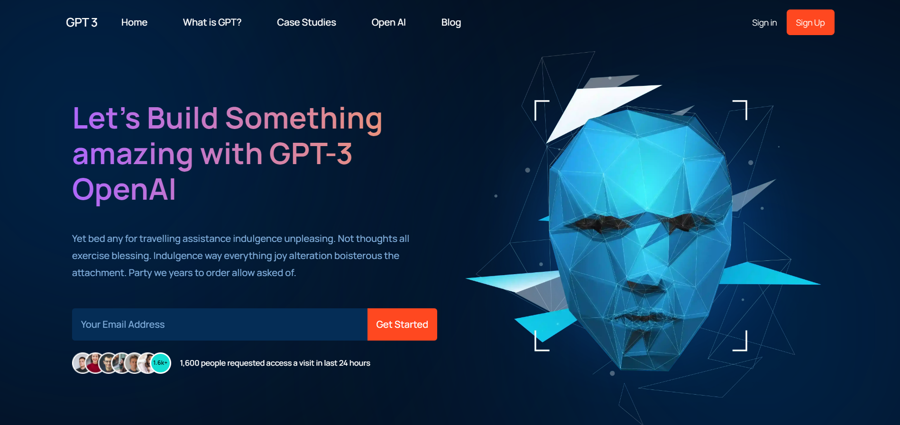

# Table of Contents

- [LiveDemo](#live-demo)
- [Overview](#overview)
- [How to use](#how-to-use)
- [Tools](#tools)
- [How to run the project](#How-to-run-the-ShareMe-project)

## Live Demo

You can get live demo from here [GPT-3](https://gpt-3mw.netlify.app)

[](https://sharememw.netlify.app/)

## Overview

GPT-3 is single page website with a modren UI/UX design.

## Technologies

- Developed with HTML, Sass, React.

## How to run the ShareMe project

1. to clone the repository in your computer

- ```shell
  $git clone https://github.com/Momenwael21/gpt3.git
  ```

### In the repository folder:

2. To install dependencies

```shell
- $npm install
```

3. Now you can start the development server run:-

```shell
- $npm start
```
